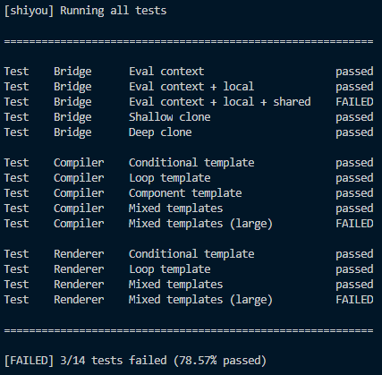

# About <a href="https://nodejs.org"></a>

**jshiyou** (or *javascript shiyou*) is a simple testing tool for Node.js.

<p align="center">
  
</p>

# Getting started

You can install jshiyou like any other npm package.

```
npm i @exom-dev/jshiyou
```

Here is a basic example.

```js
const shiyou = require('@exom-dev/jshiyou');

// Test category, test name, and test handler (true if passed, false otherwise).
shiyou.test('Arithmetic', 'One plus one', () => 1 + 1 === 2);
shiyou.test('Arithmetic', 'Two times four', () => 2 * 4 === 8);
shiyou.test('Arithmetic', 'Eleven mod two', () => 11 % 2 === 1);

shiyou.test('Equality', 'Strings', () => 'test' === 'test');
shiyou.test('Equality', 'Floats', () => 2.5 === 2.5);

shiyou.test('Misc', 'Null is falsy', () => !null);

shiyou.run();
```

This code will generate the following output:

```
[shiyou] Running all tests

==============================================

Test    Arithmetic    One plus one      passed
Test    Arithmetic    Two times four    passed
Test    Arithmetic    Eleven mod two    passed

Test    Equality      Strings           passed
Test    Equality      Floats            passed

Test    Misc          Null is falsy     passed

==============================================

[PASSED] All tests passed
```

# Documentation

### Test

To register a test, simply use the `test` function.

```js
function test(category: string, name: string, handler: function);
```

##### Params

- **category** - the test category
- **name** - the test name
- **handler** - the test function, which must return true if the test passed, or false otherwise

##### Remarks

- two tests in the same category cannot have the same name
- a test cannot have the name `$`, because it is reserved

### Run

To run all tests, or only the tests from one category, use the `run` function.

```js
function run(category: string | undefined): bool;
```

##### Params

- **category** - all of the tests in this category will be ran. If undefined, all tests in all categories will be ran.

##### Returns

True, if the tests passed. False otherwise.

### Silent

If you want to silence jshiyou, such that nothing is printed to stdout, use the `silent` function.

```js
function silent(value: bool | undefined);
```

##### Params

- **value** - whether or not to silence jshiyou. If undefined, defaults to true.

### Reset

To unregister all tests, use the `reset` function.

```js
function reset();
```

##### Remarks

- this function will also unsilence jshiyou if it was previously silenced

# License <a href="https://github.com/exom-dev/jshiyou/blob/master/LICENSE"></a>

**jshiyou** was created by The Exom Developers. It is licensed under the [MIT license](https://github.com/exom-dev/jshiyou/blob/master/LICENSE).

This project has no dependencies.